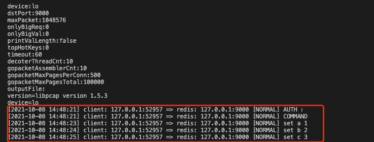

## redis抓包工具 myRedisCapture
redis可通过`monitor`命令获取执行的命令.  
但大部分redis proxy并不支持monitor命令,抓包请求命令与来源ip对于proxy来说是一个非常常见的需求。  
该工具通过[gopacket](https://github.com/google/gopacket)这个库完成redis请求的抓包。  
关于[gopacket](https://github.com/google/gopacket)的使用,可参考[examples](https://github.com/google/gopacket/tree/master/examples)下的示例。  
该工具主要参考:[reassemblydump](https://github.com/google/gopacket/blob/master/examples/reassemblydump/main.go)  

### 注意事项
1. 用`root`账户执行;
2. 该工具无法完整捕获命令,特别在请求非常频繁时,捕获的请求数和实际执行的请求数会有较大差距;
3. 该工具如果占用内存过高,可通过减少`--gopacket-max-pages-per-conn`、`--gopacket-max-pages-total`降低内存占用.
4. 通过下面命令开启debug模式,会将相关错误信息输出:`export MYREDIS_CAPTURE_DEBUG=true`

### 参数说明
- `--device`: 网络设备名称,如`eth1`、`eth0`、`lo`等;
- `--dst-port`:目标端口号;
- `--max-packet`:最大包大小,默认是1MB,不建议修改;
- `--only-big-req`: 默认为0,不生效.如果`--only-big-req`大于0,则只抓取 pipeline命令数大于`--only-big-req`，`mget`、`mset`等操作的key个数超过`--only-big-req`的命令;
- `--only-big-val`: 默认为0,不生效.如果`--only-big-val`大于0,则只抓取命令中存在value大小大于`--only-big-val`的命令;
- `--print-val-length`:该功能待完成;
- `--top-hot-keys`: 该功能待完成;
- `--decoder-thread-cnt`:请求包解析者goroutine数,默认20;
- `--timeout`: 请求抓取时间;
- `--gopacket-assembler-cnt`: 指定accembler个数。如果请求包较大，一个请求极大概率会被切割为多个packet发送给redis,此时如果想获取完整请求命令就需要使用tcp重组技术，该参数与该技术相关。
- `--gopacket-max-pages-per-conn`: 默认500, 抓取时每个连接达到最大page数后,会强制flush;
- `--gopacket-max-pages-total`: 所有抓取到的连接总page数最大个数;
- `--output-file`: 结果输出到文件,如果为空则输出到标注输出.

### 使用示例
```sh
#示例1
./myredisCapture --device=eth1 --dst-port=6379 --timeout=60 --output-file=1.log

#示例2
./myredisCapture --device=eth1 --dst-port=6379 --timeout=600 --output-file=1.log --gopacket-max-pages-per-conn=200 --gopacket-max-pages-total=50000
```
结果示例:  


### 架构图
